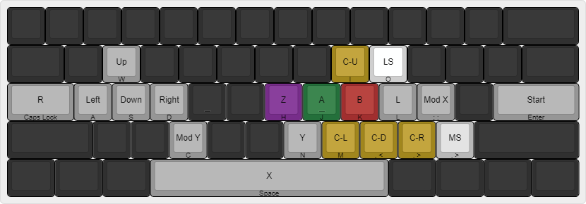

# Day 0

- Set up Slippi (with a totally legally obtained Melee iso from my Wii and
  Melee disk which is obviously legally obtained).
- Using a B0XX AHK script [from this video](https://youtu.be/-iHZ0jzhpL0).
- Using a custom keymap:
  
- Playing against CPUs.
- Not used to no buffer.
- Lost to a lvl 4 smh help.
- Maining Mario cuz "fundamentals" (I just like the character).
- I think ill switch to normal b0xx layout but mapped to a keeb.
