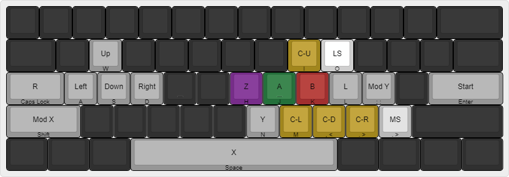

# Day 0

- Set up Slippi (with a totally legally obtained Melee iso from my Wii and
  Melee disk which is obviously legally obtained).
- Using a B0XX AHK script [from this video](https://youtu.be/-iHZ0jzhpL0).
- Using a custom keymap:
  
